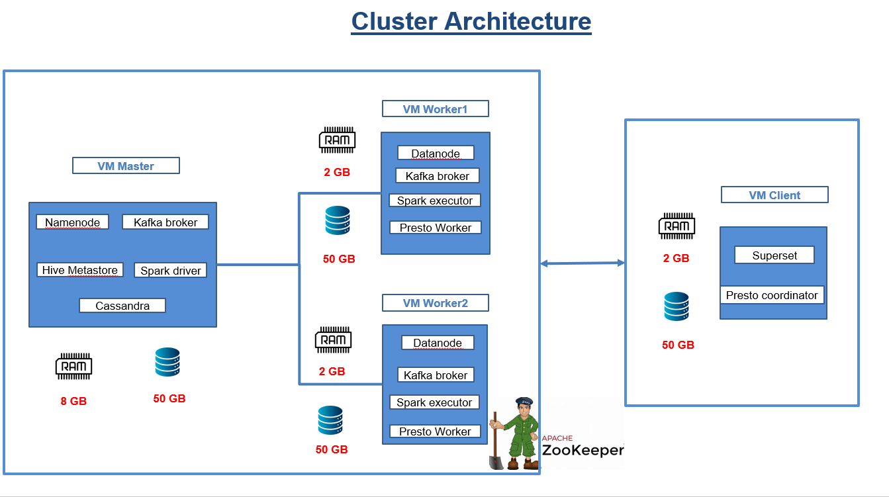

# Real time Credit card FraudDetection

This project implements a scalable, real-time fraud detection pipeline using Apache Spark, Kafka, Hudi, and Presto. It processes large-scale transaction data in real time, leveraging stream and batch processing to detect fraudulent activities efficiently.

---

## 🚀 Pipeline

---

## 🛠️ Used Technologies

- **Apache Kafka**: For real-time data streaming.
- **Apache Cassandra**: For distributed NoSQL database storage.
- **Apache Spark**: For data processing and machine learning.
- **Apache Hudi**: For OLAP and data versioning.
- **Apache Hive Metastore**: For managing metadata.
- **Presto**: For distributed SQL querying.
- **Apache Superset**: For data visualization.

---

## 🔧 Cluster Architecture

---

## 🗂️ Data Format

- Customers.csv : contains customer information such as credit card number, first and last name, gender, job title, and other related attributes.
- Transactions.csv : contains transaction information such as Trans_date, category, merchant and other related attributes.
- Products.json : contains product information such as price, category, description and other related attributes.

---

## 💻 Model Used

### Random Forest
- Implemented in **PySpark's MLlib** for distributed and scalable machine learning.
- PySpark's implementation of Random Forest is ideal for handling large datasets as it leverages the distributed computing power of Spark. It builds multiple decision trees and aggregates their predictions to improve the model's accuracy and robustness.

---

## 🌟 Contributors

 - Mohamed amine Hassine
 - Baligh Ghaouar
 
---

## 🔒 License

This project is licensed under the **MIT License**. See the `LICENSE` file for details.

---

## 📽️ YouTube Link

Watch the project overview on [YouTube](https://youtu.be/xybaE9OcHRY?si=-y_FTJVKH5dQxO5s).
